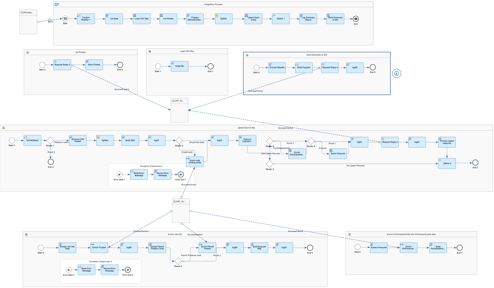
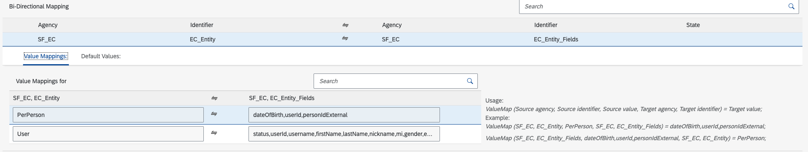

# SAP SuccessFactors Employee Central Integration with Workday

\| [Recipes by Topic](../../readme.md ) \| [Recipes by Author](../../author.md ) \| [Request Enhancement](https://github.com/SAP-samples/cloud-integration-flow/issues/new?assignees=&labels=Recipe%20Fix,enhancement&template=recipe-request.md&title=Improve%20SAP%20SuccessFactors%20Employee%20Central%20Integration%20with%20Workday) \| [Report a bug](https://github.com/SAP-samples/cloud-integration-flow/issues/new?assignees=&labels=Recipe%20Fix,bug&template=bug_report.md&title=Issue%20with%20SAP%20SuccessFactors%20Employee%20Central%20Integration%20with%20Workday)\| [Fix documentation](https://github.com/SAP-samples/cloud-integration-flow/issues/new?assignees=&labels=Recipe%20Fix,documentation&template=bug_report.md&title=Docu%20fix%20SAP%20SuccessFactors%20Employee%20Central%20Integration%20with%20Workday) \|

  | [SAP Accelerator Business Hub](https://api.sap.com/allcommunity) |
 ----|----|

This integration replicates employee master data including User, Personal info, Employment info, Job info, Compensation info, National ID, Email, Phone, Address, Emergency contacts, Global info, etc from Workday to SuccessFactors Employee Central.

Workday need to generate employee master data CSV files based on predefined templates, and compress all these files into one zip file then upload to SFTP.

The iflow is scheduled to load the zip file from SFTP, validate the data against existing data in EC, skip records if the same data already exist in EC, convert data to EC XML payload and upsert the data into EC. The iflow log all records which upsert fails or skipped with detailed error message, and send the processing summary log to EC Execution Manager.

The value mapping is for SuccessFactors entity and fields mapping.

[Download the integration package](SAPSuccessFactorsEmployeeCentralIntegrationwithWorkday.zip)\
[View package on the SAP Accelerator Business Hub](https://api.sap.com/package/SAPSuccessFactorsEmployeeCentralIntegrationwithWorkday)\
[View documentation](SAPSuccessFactorsEmployeeCentralIntegrationwithWorkday.pdf)\
[View high level effort](effort.md)

 ## Integration flows

### Replicate Employee Data from Workday to SAP SuccessFactors Employee Central
Load employee master data CSV files from Workday SFTP, validate, transform and replicate the data to SAP SuccessFactors EC \
 

### Value Mapping for SAP SuccessFactors EC and Workday integration
 Value Mapping for SAP SuccessFactors EC Entity and Fields \
  
