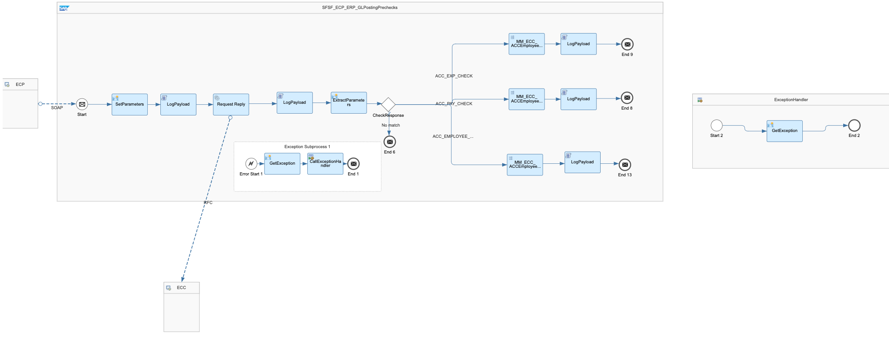
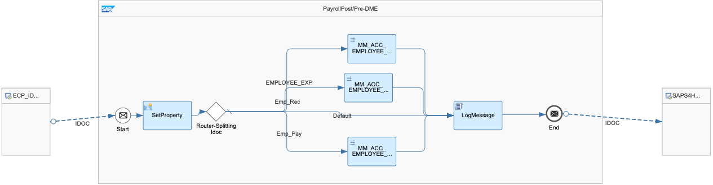

# SAP SuccessFactors Employee Central Payroll Integration with SAP S_4HANA or SAP ERP

\| [Recipes by Topic](../../readme.md ) \| [Recipes by Author](../../author.md ) \| [Request Enhancement](https://github.com/SAP-samples/cloud-integration-flow/issues/new?assignees=&labels=Recipe%20Fix,enhancement&template=recipe-request.md&title=ImproveSAP%20SuccessFactors%20Employee%20Central%20Payroll%20Integration%20with%20SAP%20S_4HANA%20or%20SAP%20ERP ) \| [Report a bug](https://github.com/SAP-samples/cloud-integration-flow/issues/new?assignees=&labels=Recipe%20Fix,bug&template=bug_report.md&title=Issue%20withSAP%20SuccessFactors%20Employee%20Central%20Payroll%20Integration%20with%20SAP%20S_4HANA%20or%20SAP%20ERP ) \| [Fix documentation](https://github.com/SAP-samples/cloud-integration-flow/issues/new?assignees=&labels=Recipe%20Fix,documentation&template=bug_report.md&title=Docu%20fixSAP%20SuccessFactors%20Employee%20Central%20Payroll%20Integration%20with%20SAP%20S_4HANA%20or%20SAP%20ERP ) \|

 | [SAP Business Accelerator Hub](https://api.sap.com/allcommunity) |
----|----|

:warning: :warning: \
DISCLAIMER: The package content was removed from GitHub. The integration supported by SAP is API to API integration. The code delivered here was transfer through integration flows. For more information about the payroll results transfer to accounting, see [SAP Note 2907385](https://me.sap.com/notes/2907385). \
:warning::warning:

Replication of Payroll posting data from SAP SuccessFactors Employee Central to SAP ERP or SAP S/4HANA. This data includes Cost Center/GL accounts/Expenses.

This package contains 2 iflows:

* Pre-check for Payroll posting
* Posting of Payroll data.

[View documentation](ConfigGuide_PayrollPostingFromSAPSucccessfactorsEmployeeCentralPayrolltoS4HANAorSAPERP.pdf)

## Integration flows

### Prechecks for Payroll Posting
Integration Flow to perform Pre-checks before actual G/L Posting\

### Replicate Payroll Data
This Integration flow for Payroll Posting from Employee Central Payroll to S4HANA system.\

