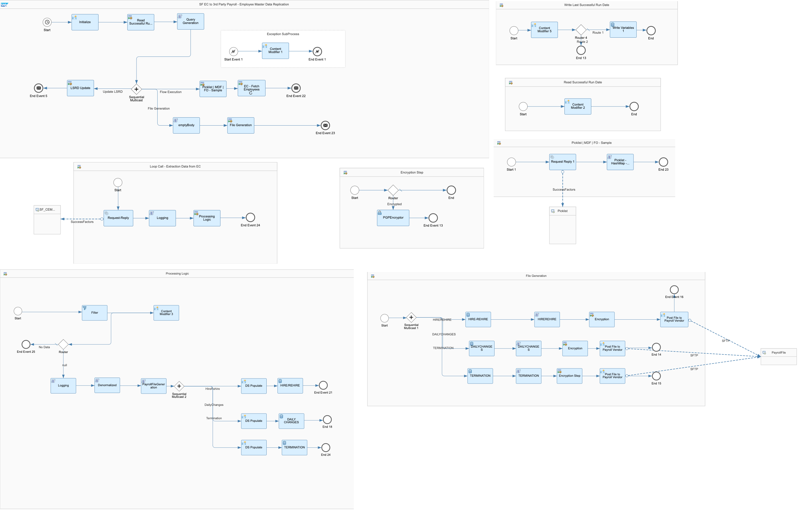
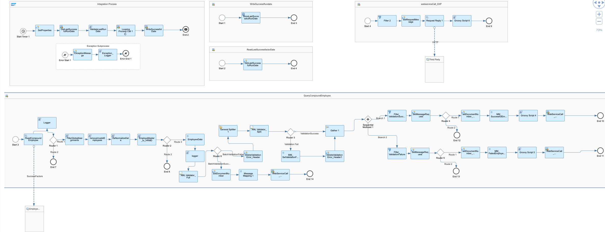

# SAP SuccessFactors Employee Central with Third-Party Payroll Vendor

\| [Recipes by Topic](../../readme.md ) \| [Recipes by Author](../../author.md ) \| [Request Enhancement](https://github.com/SAP-samples/cloud-integration-flow/issues/new?assignees=&labels=Recipe%20Fix,enhancement&template=recipe-request.md&title=ImproveSAP%20SuccessFactors%20Employee%20Central%20with%20Third-Party%20Payroll%20Vendor ) \| [Report a bug](https://github.com/SAP-samples/cloud-integration-flow/issues/new?assignees=&labels=Recipe%20Fix,bug&template=bug_report.md&title=Issue%20withSAP%20SuccessFactors%20Employee%20Central%20with%20Third-Party%20Payroll%20Vendor ) \| [Fix documentation](https://github.com/SAP-samples/cloud-integration-flow/issues/new?assignees=&labels=Recipe%20Fix,documentation&template=bug_report.md&title=Docu%20fixSAP%20SuccessFactors%20Employee%20Central%20with%20Third-Party%20Payroll%20Vendor ) \|

 | [SAP Business Accelerator Hub](https://api.sap.com/allcommunity) |
----|----|

This package provides templates that support integration of business processes in your on-demand SAP SuccessFactors Employee Central system with your Third Party Payroll Vendor

Template A - Provides support for Delta based integration with seperate files required for HIRE/REHIRE, Daily Changes and TERMINATION

[Download the reuseable integration Package](SAPSuccessFactorsEmployeeCentralwithThird-PartyPayrollVendor.zip)\
[View package on the SAP Business Accelerator Hub](https://api.sap.com/package/SAPSuccessFactorsEmployeeCentralwithThirdPartyPayrollVendor/overview)\
[Configuration Guide for Template A](ConfigGuide-SFECto3rdPartyPayroll-TemplateA.pdf)\
[Configuration Guide for Template B](ConfigGuide-EmployeeMasterDataIntegrationSuccessfactorsEmployeeCentraltoThirdParty(SAP_IDOC).pdf)\
[View high level effort](effort.md)

## Integration flows

### SF EC to 3rd Party Payroll - Employee Master Data Replication - Template A

Delta based integration with seperate files for Hire/Rehire, Daily Changes and Termination\
[View on SAP Business Accelerator Hub](https://api.sap.com/integrationflow/SF_EC_to_3rd_Party_Payroll_-_Employee_Master_Data_Replication_-_Template_A)

### Employee Master Data Replication - Template B

Delta based integration with separate files for Hire/Rehire, Daily Changes and Termination\
[View on SAP Business Accelerator Hub](https://api.sap.com/integrationflow/Employee_Master_Data_Replication_-_Template_B)
