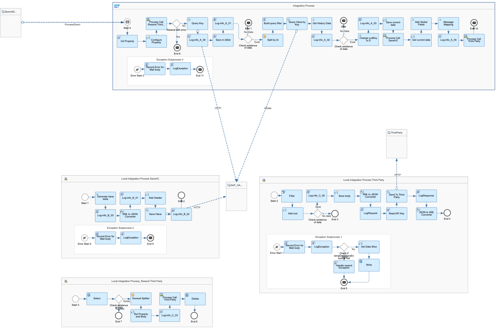
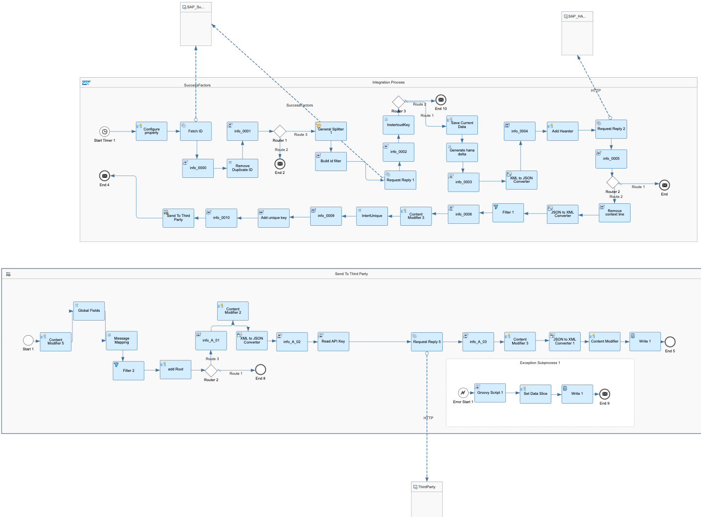
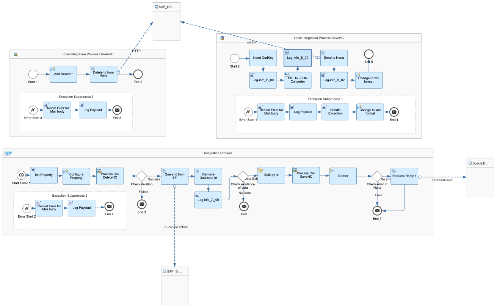
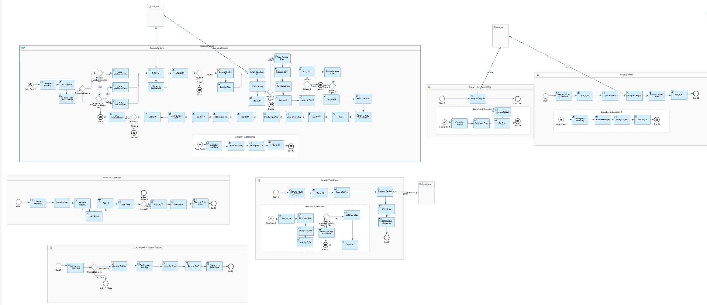

# SAP SuccessFactors Integration with Third Party  - Employee Job Delta Change

\| [Recipes by Topic](../../readme.md ) \| [Recipes by Author](../../author.md ) \| [Request Enhancement](https://github.com/SAP-samples/cloud-integration-flow/issues/new?assignees=&labels=Recipe%20Fix,enhancement&template=recipe-request.md&title=Improve%20SAP%20SuccessFactors%20Integration%20with%20Third%20Party%20-%20Employee%20Job%20Delta%20Change) \| [Report a bug](https://github.com/SAP-samples/cloud-integration-flow/issues/new?assignees=&labels=Recipe%20Fix,bug&template=bug_report.md&title=Issue%20with%20SAP%20SuccessFactors%20Integration%20with%20Third%20Party%20-%20Employee%20Job%20Delta%20Change)\| [Fix documentation](https://github.com/SAP-samples/cloud-integration-flow/issues/new?assignees=&labels=Recipe%20Fix,documentation&template=bug_report.md&title=Docu%20fix%20SAP%20SuccessFactors%20Integration%20with%20Third%20Party%20-%20Employee%20Job%20Delta%20Change) \|

  | [SAP Accelerator Business Hub](https://api.sap.com/allcommunity) |
 ----|----|

With this integration package, you can transport the EmpJob delta changes (create, update&nbsp; and delete) via ODATA API from SAP SuccessFactors to Third Party.

This package enables you to do the following:

<ul>
 <li>SAP SuccessFactors Employee Central Job Information Initial Load (Save Data to HANA DB as history data, if needed, send to Third Party for initial load)</li>
 <li>SAP SuccessFactors Employee Central Job Information Delta Load (Send data to Third Party for delta changes create, update and delete via ODATA API )</li>
 <li>SAP SuccessFactors Employee Central Job Information Special Deletion Send (Send data to Third Party for the special deletion situation :If all records of the employee were deleted, no record is returned in the response )</li>
</ul>

[Download the integration package](SAPSuccessFactorsIntegrationwithThirdParty-EmployeeJobDeltaChange.zip)\
[View package on the SAP Accelerator Business Hub](https://api.sap.com/package/SAPSuccessFactorsIntegrationwithThirdPartyEmpJobDeltaChange)\
[View documentation - Job Information Delta Load](Documentation_SF-EC-Job-Information-Delta-Load.pdf)\
[View Documentation - Job Information Initial Load](Documentation_SF-EC-Job-Information-Initial-Load.pdf)\
[View Documentation - Job Information Special Deletion](Documentation_SF-EC-Job-Information-Special-Deletion.pdf)\
[View high level effort](effort.md)

 ## Integration flows
### SAP SuccessFactors Employee Central Job Information Special Deletion Send
Step2: Send data to Third Party for the special deletion situation :If all records of the employee were deleted, no record is returned in the response \
 
### SAP SuccessFactors Employee Central Job Information Initial Load
Save Data to HANA DB as history data, if needed, send to Third Party for initial load \
 
### SAP SuccessFactors Employee Central Job Information Special Deletion Compare
Step1: Send data to Third Party for the special deletion situation :If all records of the employee were deleted, no record is returned in the response \
 
### SAP SuccessFactors Employee Central Job Information Delta Load
Send data to Third Party for delta changes create, update and delete via ODATA API  \
 
