# SAP SuccessFactors Employee Central Integration with SAP Commissions 

\| [Recipes by Topic](../../readme.md ) \| [Recipes by Author](../../author.md ) \| [Request Enhancement](https://github.com/SAP-samples/cloud-integration-flow/issues/new?assignees=&labels=Recipe%20Fix,enhancement&template=recipe-request.md&title=Improve%20SAP%20SuccessFactors%20Employee%20Central%20Integration%20with%20SAP%20Commissions) \| [Report a bug](https://github.com/SAP-samples/cloud-integration-flow/issues/new?assignees=&labels=Recipe%20Fix,bug&template=bug_report.md&title=Issue%20with%20SAP%20SuccessFactors%20Employee%20Central%20Integration%20with%20SAP%20Commissions)\| [Fix documentation](https://github.com/SAP-samples/cloud-integration-flow/issues/new?assignees=&labels=Recipe%20Fix,documentation&template=bug_report.md&title=Docu%20fix%20SAP%20SuccessFactors%20Employee%20Central%20Integration%20with%20SAP%20Commissions) \| 

  | [SAP Business Accelerator Hub](https://api.sap.com/allcommunity) | 
 ----|----| 

This integration package provides integration flows to replicate employee data from SAP SuccessFactors Employee Central to SAP Commissions.

This package provides an Integration between SAP SuccessFactors Employee Central with SAP Commissions to replicate employee data. The customer can choose between Event-Based and Timer-Initiated Integration Flow based on their business requirement.

&nbsp;

NOTE: While the standard content (<a href="https://api.sap.com/package/SAPSuccessFactorsEmployeeCentralintegrationwithSAPCommissions/integrationflow" rel="nofollow">https://api.sap.com/package/SAPSuccessFactorsEmployeeCentralintegrationwithSAPCommissions/integrationflow</a>) contains file-based Integration flows, this integration package provides Integration based on APIs and/or Event-Driven Integration.

[Download the integration package](SuccessFactorsECIntegrationwithCommission.zip)\
[View package on the SAP Business Accelerator Hub](https://api.sap.com/package/SuccessFactorsECIntegrationwithCommission)\
[View documentation](SuccessFactors_EmployeeCentral_Commission_Integration.pdf)\
[View high level effort](effort.md)
## Integration artifacts
### Script Collection Employee Data Replication 
Stores all the script files utilized in the Integration Flows. \
 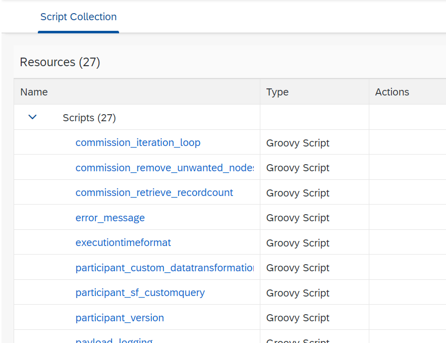
### Message Mapping for employee data between SAP SuccessFactors Employee Central and SAP Commissions 
Message Mapping to map the Employee Data to Participant Object \
 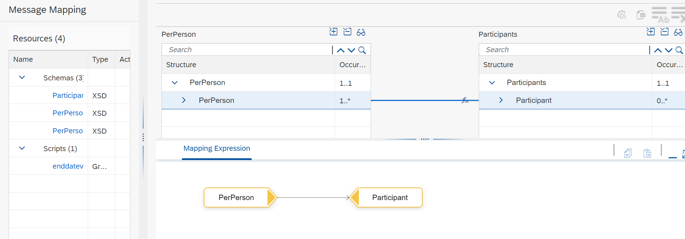
### Message Mapping for title data between SAP SuccessFactors Employee Central and SAP Commissions 
Message Mapping to map Job Titles to Title Object \
 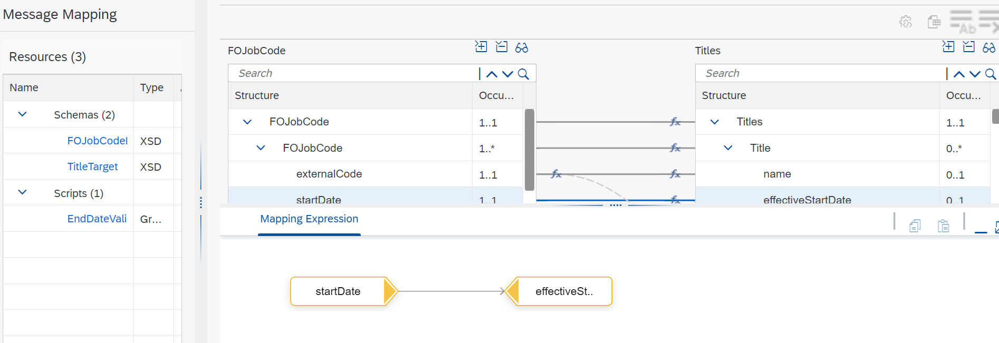
 ### Message Mapping for position data between SAP SuccessFactors Employee Central and SAP Commissions 
Message Mapping to map the Employee Job Position Data to Position Object \
 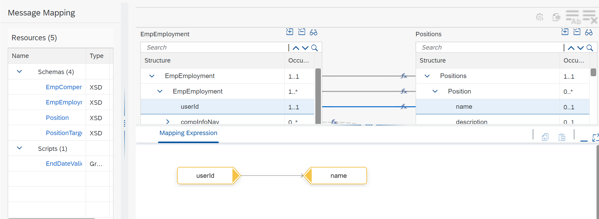
### Reprocess Error Event Messages 
Integration Flow to re-process the errored messages from Event-Initiated Replication \
 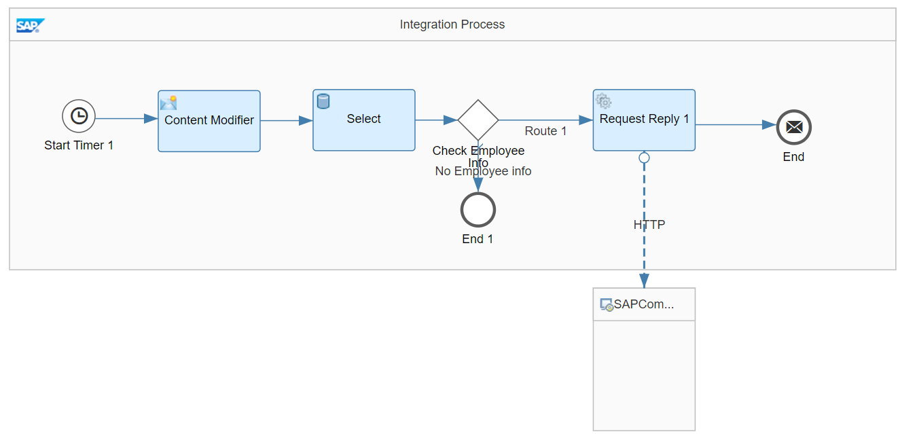
### Replicate employee position from SAP SuccessFactors Employee Central to SAP Commissions 
Timer-Initiated Integration Flow to replicate employee job position data from SAP SuccessFactors Employee Central to SAP Commissions \
 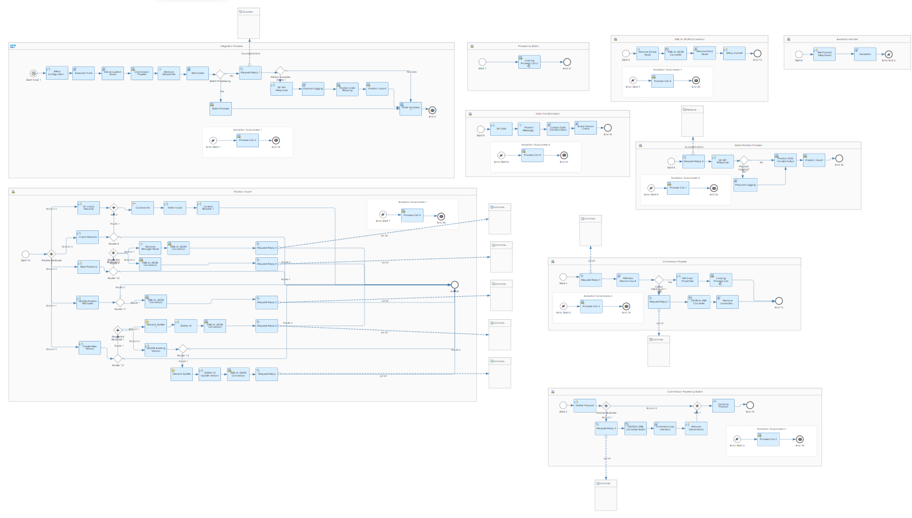
### Replicate Job Title from SuccessFactors Employee Central to Commission 
Timer-Initiated Integration Flow to replicate Job Titles from SuccessFactors Employee Central to Commission \
 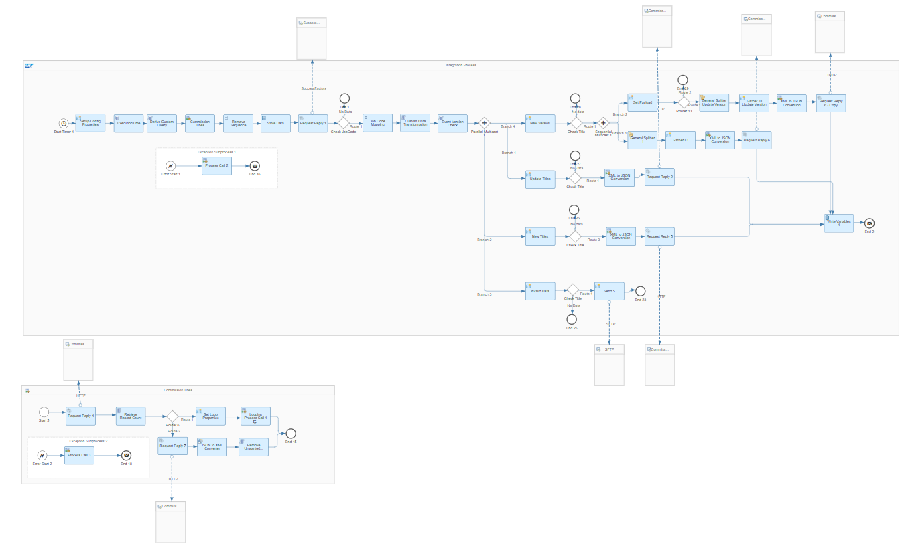\
 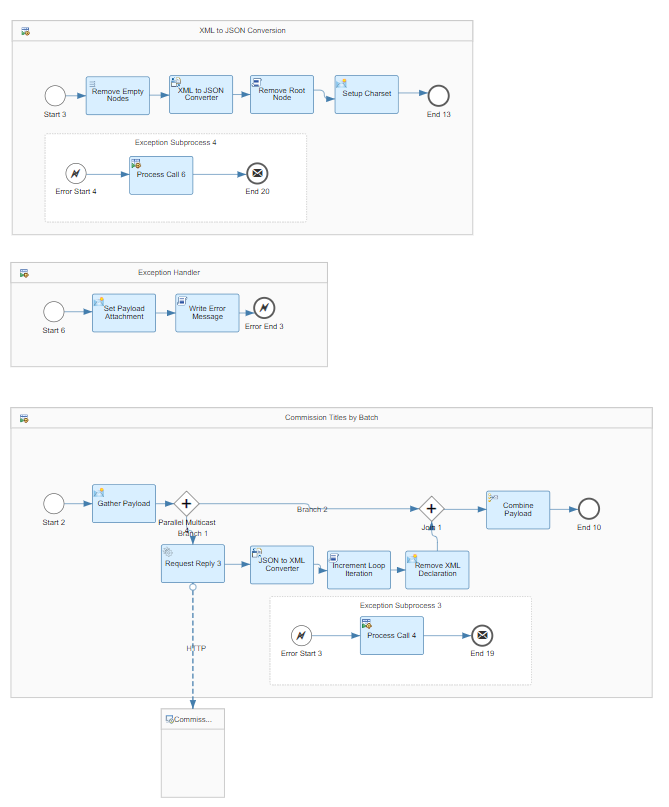
 ### Push employee job position from SAP SuccessFactors Employee Central to SAP Commissions 
Event-Initiated Integration between SAP SuccessFactors Employee Central and SAP Commissions. The iflow replicates employee job position data. \ 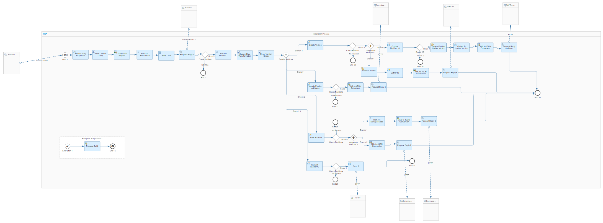\
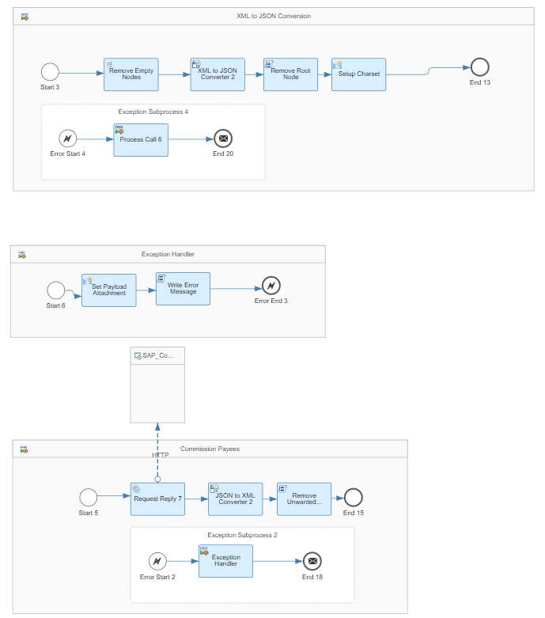
### Push employee data from SAP SuccessFactors Employee Central to SAP Commissions 
Event-Initiated Integration between SAP SuccessFactors Employee Central and SAP Commissions. The Iflow replicates employee data. \
 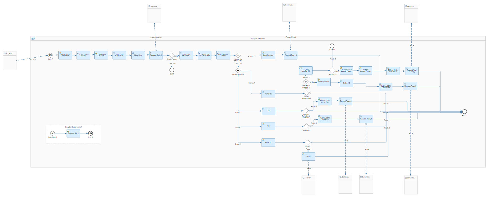\
 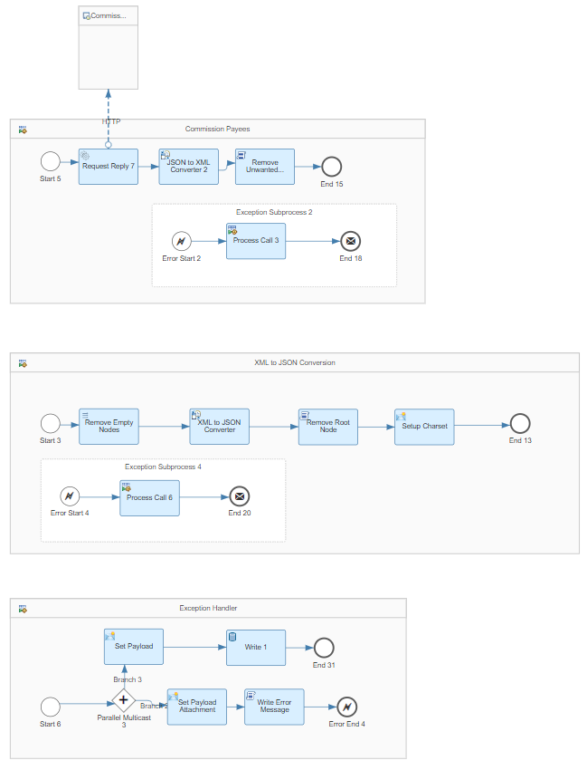
 ### Replicate employee data from SAP SuccessFactors Employee Central to SAP Commissions 
Timer-Initiated Integration Flow to replicate employee data from SAP SuccessFactors Employee Central to SAP Commissions. \
 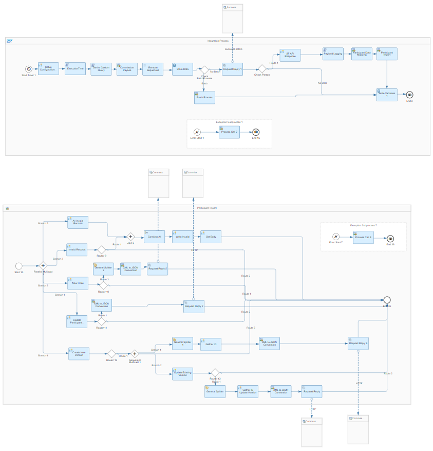\
 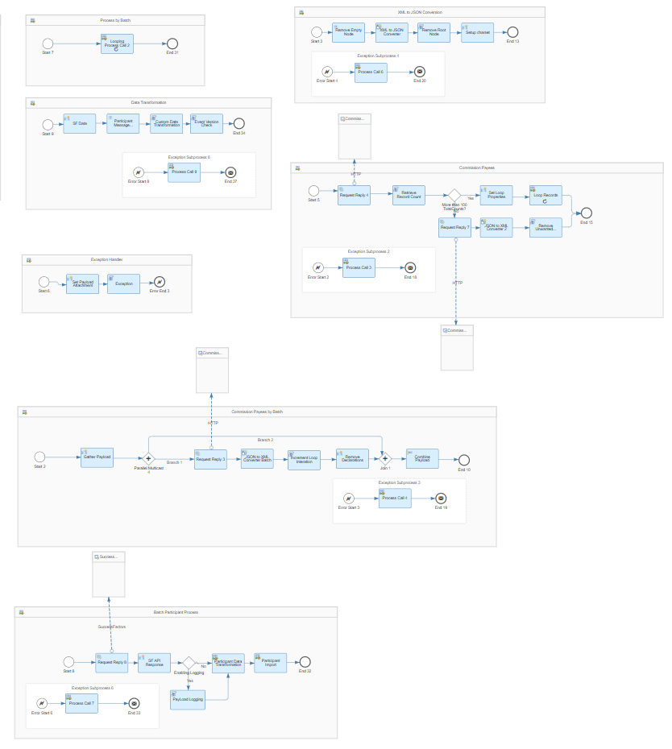 
 ### Value Mapping Integration Configuration Controller 
Value Mapping to define Source and Target Data Settings that control the Integration flow behavior \
 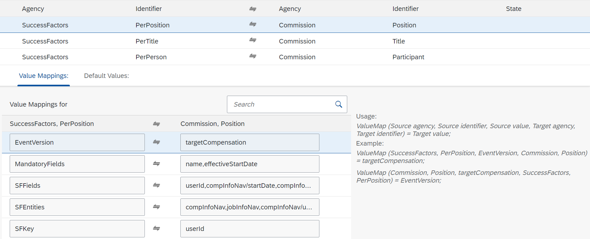\
 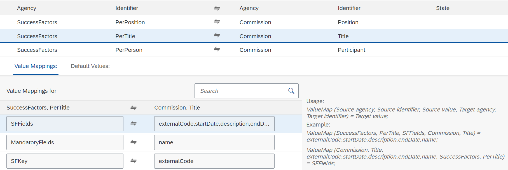\
 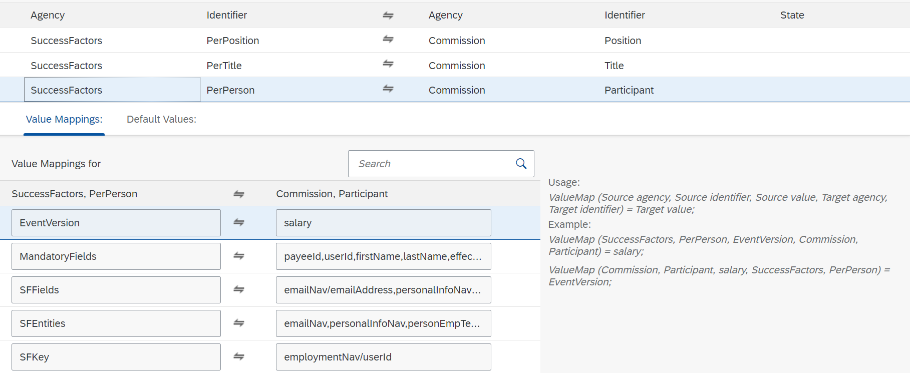