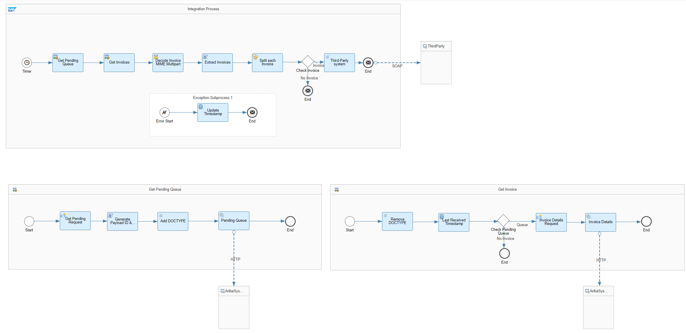
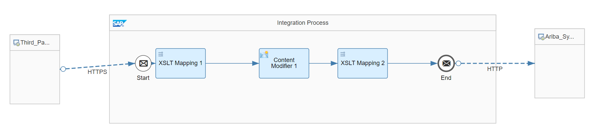

# Third Party Invoice Status Integration with SAP Ariba network

\| [Recipes by Topic](../../readme.md ) \| [Recipes by Author](../../author.md ) \| [Request Enhancement](https://github.com/SAP-samples/cloud-integration-flow/issues/new?assignees=&labels=Recipe%20Fix,enhancement&template=recipe-request.md&title=Improve%20Third%20Party%20Invoice%20Status%20Integration%20with%20SAP%20Ariba%20network%20 ) \| [Report a bug](https://github.com/SAP-samples/cloud-integration-flow/issues/new?assignees=&labels=Recipe%20Fix,bug&template=bug_report.md&title=Issue%20with%20Third%20Party%20Invoice%20Status%20Integration%20with%20SAP%20Ariba%20network%20 ) \| [Fix documentation](https://github.com/SAP-samples/cloud-integration-flow/issues/new?assignees=&labels=Recipe%20Fix,documentation&template=bug_report.md&title=Docu%20fix%20Third%20Party%20Invoice%20Status%20Integration%20with%20SAP%20Ariba%20network ) \|

 | [SAP Accelerator Business Hub](https://api.sap.com/allcommunity) |
----|----|

This integration flow illustrates Invoice status handling from any Invoice system to SAP Ariba Network based on cXML. Invoice is a critical process during the end to end process chain between SAP and SAP Ariba.  Some customers are using a central Invoice Management system instead of exchanging the invoice data directly to SAP. The integration flows can be used to get Invoice data from SAP Ariba network in order to send them to any Invoice Management system as cXML.

This package allows you to do the following:

* Connect the SAP Ariba network to Third-Party Invoice status
* Connect Third Party Invoice status to SAP Ariba network

[Download the integration package](zip-file-name.zip)\
[View package on the SAP Accelerator Business Hub](https://api.sap.com/package/ThirdPartyinvoicestatusIntegrationwiththeAribanetwork/overview)

## Integration Flows

### Connect the SAP Ariba network to Third-Party Invoice status
An integration flow which illustrates how to process invoices from the SAP Ariba Network to any Third party invoice system based on cXML.\
[View on SAP Accelerator Business Hub](https://api.sap.com/integrationflow/Ariba_Network_Invoice_XML_to_any_Invoice_System_)

### Connect Third Party Invoice status to SAP Ariba network
An integration flow which illustrates how to fetch status of third-party invoices and send It to SAP Ariba Network based on cXML.\
[View on SAP Accelerator Business Hub](https://api.sap.com/integrationflow/Any_Invoice_Status_System_to_Ariba_Network_Status_cXML_)
