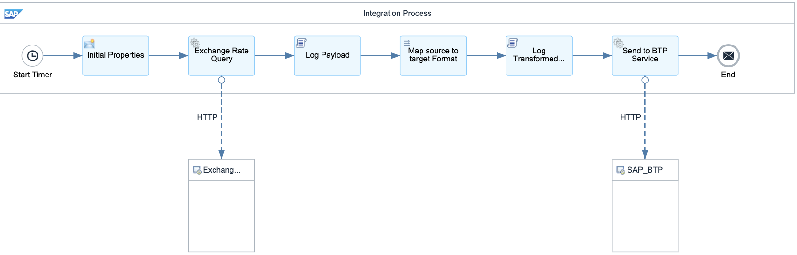

# Third-Party Integration with SAP Market Rates Management, Bring Your Own Rates data option 

\| [Recipes by Topic](../../readme.md ) \| [Recipes by Author](../../author.md ) \| [Request Enhancement](https://github.com/SAP-samples/cloud-integration-flow/issues/new?assignees=&labels=Recipe%20Fix,enhancement&template=recipe-request.md&title=Improve%20Third-Party%20Integration%20with%20SAP%20Market%20Rates%20Management,%20Bring%20Your%20Own%20Rates%20data%20option) \| [Report a bug](https://github.com/SAP-samples/cloud-integration-flow/issues/new?assignees=&labels=Recipe%20Fix,bug&template=bug_report.md&title=Issue%20with%20Third-Party%20Integration%20with%20SAP%20Market%20Rates%20Management,%20Bring%20Your%20Own%20Rates%20data%20option)\| [Fix documentation](https://github.com/SAP-samples/cloud-integration-flow/issues/new?assignees=&labels=Recipe%20Fix,documentation&template=bug_report.md&title=Docu%20fix%20Third-Party%20Integration%20with%20SAP%20Market%20Rates%20Management,%20Bring%20Your%20Own%20Rates%20data%20option) \| 

  | [SAP Business Accelerator Hub](https://api.sap.com/allcommunity) | 
 ----|----| 

Import exchange rates from a Third-party system into your SAP Market Rates Management, Bring Your Own Rates data option

This package includes an interface to receive market exchange rates from a third-party service integrated with SAP Market Rates Management's "Bring Your Own Rates" data option.&nbsp;

Complemented by the 1S4 Scope Item, it provides a complete end-to-end data flow—from replicating market rates via the service provider through SAP Market Rates Management, all the way to reaching the S/4HANA Public Cloud.

[Download the integration package](ThirdPartyMarketRatesServiceIntegrationwithSAPBTPBYOR.zip)\
[View package on the SAP Business Accelerator Hub](https://api.sap.com/package/ThirdPartyMarketRatesServiceIntegrationwithSAPBTPBYOR)\
[View documentation](ThirdPartyMarketRatesServiceIntegrationwithSAPBTPBYOR.pdf)\
[View high level effort](effort.md)
## Integration flows
### Import Third-Party Exchange Rates to SAP Market Rates Management - Upload API 
The IFlow reads the data from the exchange rates, transforms it and send to SAP Market Rates Management, Bring Your Own Rates data option \
 