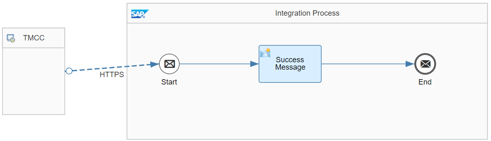

# Ticketmaster Journal Entry Integration with SAP S/4HANA Cloud

\| [Recipes by Topic](../../readme.md ) \| [Recipes by Author](../../author.md ) \| [Request Enhancement](https://github.com/SAP-samples/cloud-integration-flow/issues/new?assignees=&labels=Recipe%20Fix,enhancement&template=recipe-request.md&title=Improve%Ticketmaster%20Journal%20Entry%20Integration%20with%20SAP%20S4HANA%20Cloud%20 ) \| [Report a bug](https://github.com/SAP-samples/cloud-integration-flow/issues/new?assignees=&labels=Recipe%20Fix,bug&template=bug_report.md&title=Issue%20with%Ticketmaster%20Journal%20Entry%20Integration%20with%20SAP%20S4HANA%20Cloud%20 ) \| [Fix documentation](https://github.com/SAP-samples/cloud-integration-flow/issues/new?assignees=&labels=Recipe%20Fix,documentation&template=bug_report.md&title=Docu%20fix%Ticketmaster%20Journal%20Entry%20Integration%20with%20SAP%20S4HANA%20Cloud%20 ) \|

 | [SAP Accelerator Business Hub](https://api.sap.com/allcommunity) |
----|----|

Create Journal Entries from ticket sales originating from Ticketmaster Archtics and Host. With this integration package, you can post journal entries into SAP S/4HANA Cloud based on financial data extracted from Ticketmaster Archtics & Host. Within this integration, appropriate recipients will be notified of failed postings, as well as sending process updates back to the greater Ticketmaster Integration.

[Download the reuseable integration package](TicketmasterJournalEntryIntegrationwithSAPS_4HANACloud.zip)\
[View package on the SAP Accelerator Business Hub](https://api.sap.com/package/TicketmasterJournalEntryIntegrationwithSAPS4HANACloud/overview)\
[View documentation on the SAP Accelerator Business Hub](https://int.api.hana.ondemand.com/odata/1.0/catalog.svc/Files('74b5926d7eaa42a99bd41b8590151b91')/$value)

## Integration Flows

### Email Alerting for Ticketmaster Integration with SAP S4HANA Cloud
Email Alert for errors and warnings from Ticketmaster Control Center\
[View on SAP Accelerator Business Hub](https://api.sap.com/integrationflow/Email_Alerting_for_Ticketmaster_Integration_with_SAP_S4HANA_Cloud)

### Post Journal Entries from Ticketmaster Integration to SAP S4HANA Cloud
Posts Journal Entries to SAP S/4HANA Cloud from Ticketmaster Host & Archtics and logs events and confirmations back to Ticketmaster Control Center.\
[View on SAP Accelerator Business Hub](https://api.sap.com/integrationflow/Post_Journal_Entries_from_Ticketmaster_Integration_to_SAP_S4HANA_Cloud)

### Simulate Journal Entry Post from Ticketmaster Integration
Simulate request from Ticketmaster Control Center and Job Scheduler without posting journal entries into S/4HANA Cloud.\
[View on SAP Accelerator Business Hub](https://api.sap.com/integrationflow/Simulate_Journal_Entry_Post_from_Ticketmaster_Integration)

