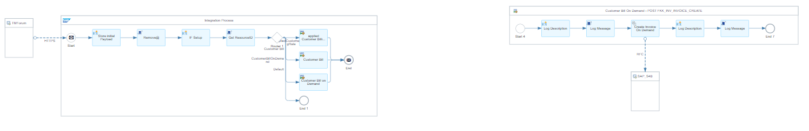
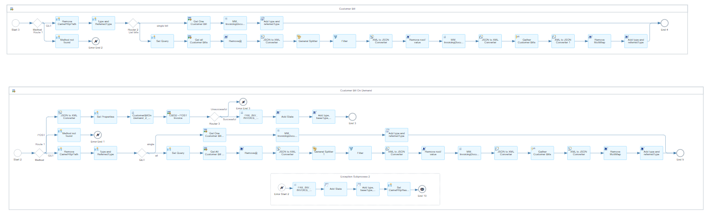
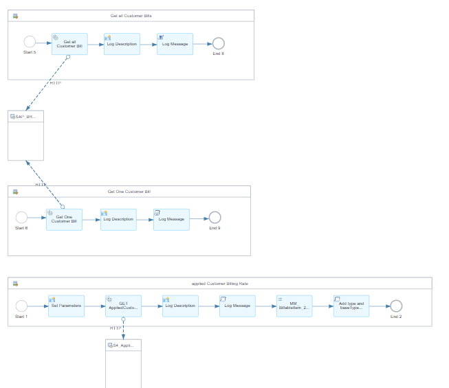
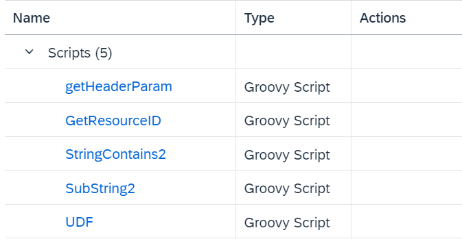
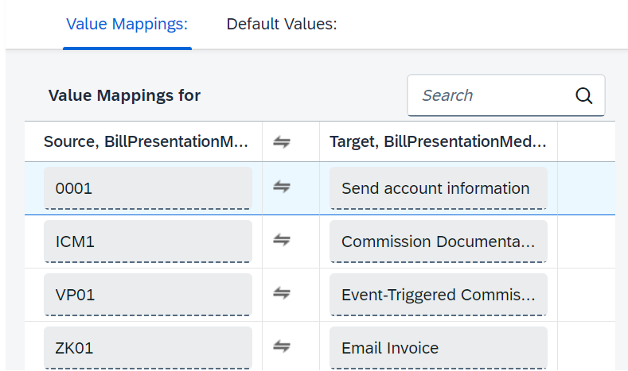

# Integration between TM Forum and SAP S/4HANA BRIM 

\| [Recipes by Topic](../../readme.md ) \| [Recipes by Author](../../author.md ) \| [Request Enhancement](https://github.com/SAP-samples/cloud-integration-flow/issues/new?assignees=&labels=Recipe%20Fix,enhancement&template=recipe-request.md&title=Improve%20Integration%20between%20TM%20Forum%20and%20SAP%20S/4HANA%20BRIM) \| [Report a bug](https://github.com/SAP-samples/cloud-integration-flow/issues/new?assignees=&labels=Recipe%20Fix,bug&template=bug_report.md&title=Issue%20with%20Integration%20between%20TM%20Forum%20and%20SAP%20S/4HANA%20BRIM)\| [Fix documentation](https://github.com/SAP-samples/cloud-integration-flow/issues/new?assignees=&labels=Recipe%20Fix,documentation&template=bug_report.md&title=Docu%20fix%20Integration%20between%20TM%20Forum%20and%20SAP%20S/4HANA%20BRIM) \| 

  | [SAP Business Accelerator Hub](https://api.sap.com/allcommunity) | 
 ----|----| 

This package provides integration content to connect TM Forum APIs to SAP Billing and Revenue Innovation Management (BRIM).

This integration package contains four distinct artifacts, including two template Integration Flows. These are specifically crafted to enable smooth inbound communication between the telecommunications system and the SAP S/4HANA BRIM system:

<ol>
 <li>Integration Flow: Replicate account management data from TM Forum to SAP S4HANA BRIM</li>
 <li>Integration Flow: Replicate customer billing management data from TM Forum to SAP S4HANA BRIM</li>
 <li>Script Collection for TM Forum Integration Flows</li>
 <li>Value Mapping for TM Forum Integration for Account Management</li>
</ol>

[Download the integration package](IntegrationbetweenTMForumandSAPS_4HANABRIM.zip)\
[View package on the SAP Business Accelerator Hub](https://api.sap.com/package/TMForumtoBRIMImplementationTemplates)\
[View documentation](ConfigGuide_tmforumtobrimimplementationtemplates.pdf)\
[View high level effort](effort.md)
## Integration flows
### Replicate customer billing management data from TM Forum to SAP S4HANA BRIM 
This Iflow replicates customer billing management data from TM Forum to SAP S4HANA BRIM \
 \
 \
 
### Replicate account management data from TM Forum to SAP S4HANA BRIM 
This Iflow replicates account management data from TM Forum to SAP S/4HANA BRIM. \
 \
 
### Script Collection for TM Forum Integration Flows 
Script collection to cover all needed functionality \
 
### Value Mapping for TM Forum Integration for Account Management 
Value Mapping for Integration Flow Replicate account management data from TM Forum to SAP S4HANA BRIM \
 \
 