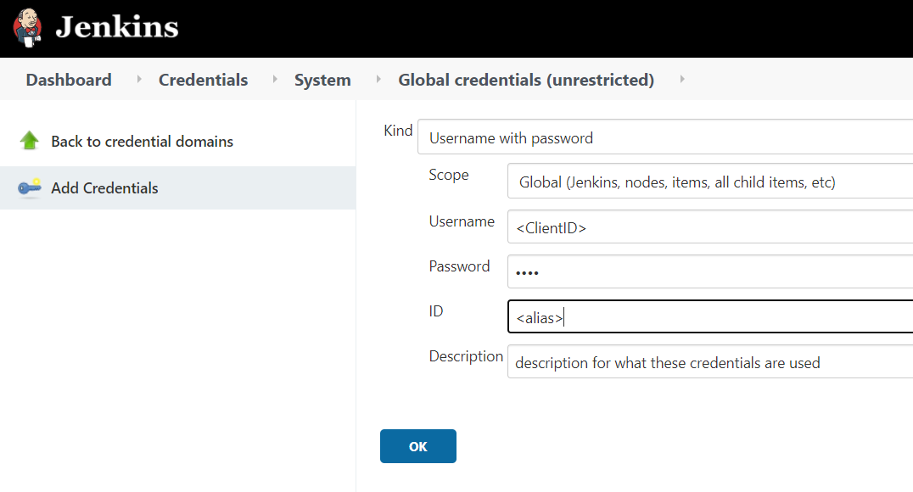
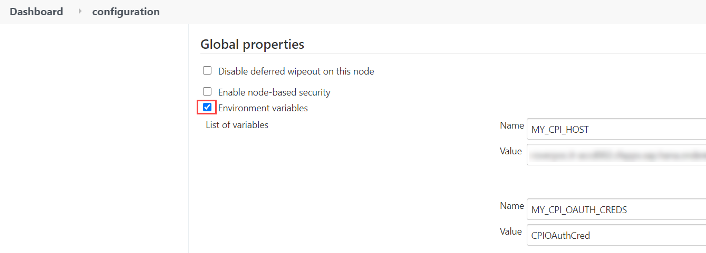
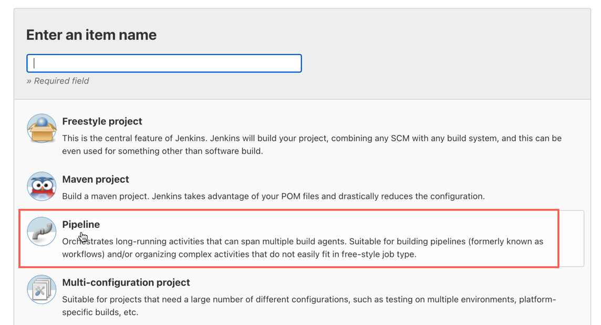
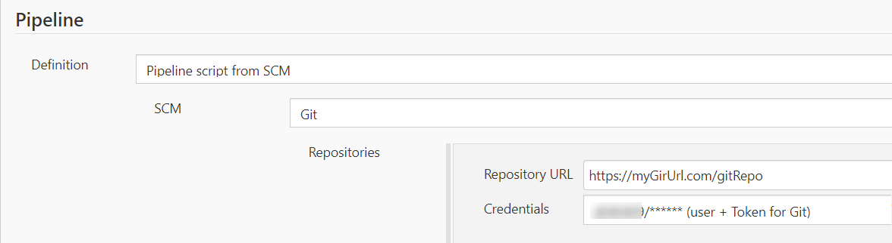
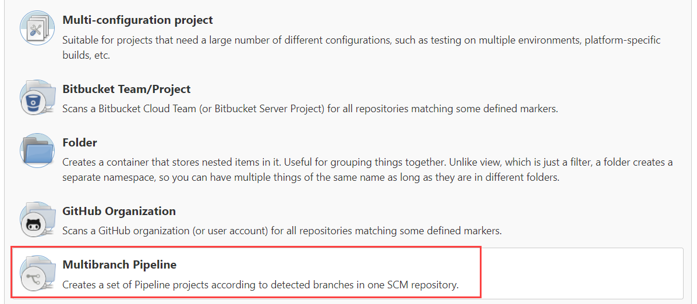
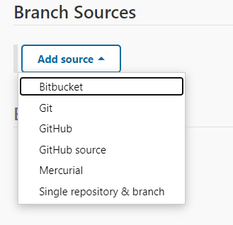
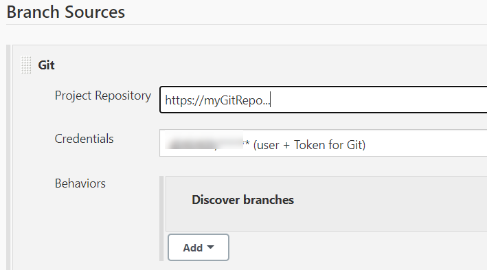
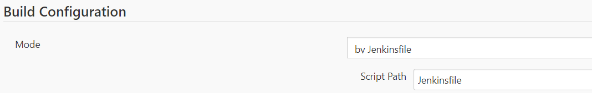
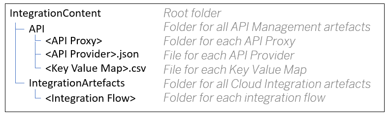

\|  [Browse by Topic](readme.md)  \| [Browse by Author](author.md) \| [Browse by Artefact Type](for/readme.md) \| [Request a Recipe](https://github.com/SAP/apibusinesshub-integration-recipes/issues/new?assignees=&labels=Recipe%20Request&template=recipe-request.md&title=How+to++) \| [Report a broken link](https://github.com/SAP/apibusinesshub-integration-recipes/issues/new?assignees=&labels=documentation&template=bug_report.md&title=Broken%20Link) \| [Contribute](../CONTRIBUTING.md)\|

# Instructions to consume the CICD Jenkins file

## Prerequisites
* Your build server is up and running. As we have used a Jenkins build server for building the pipelines, we will link to the Jenkins documentation: https://www.jenkins.io/doc/book/installing/.
But you can use your own build server, as long as it’s able to process the pipeline scripts.
* Your source code repository/version management system is up and running. In our examples, we’ve used Git, but GitHub is fine, too.
You probably need one Git repository for each pipeline script file and one Git repository for your whole integration content.
* The SAP Integration Suite capabilities API Management and/or Cloud Integration or the corresponding standalone products are up and running. If you want to try out the trial version of SAP Integration Suite, this [tutorial](https://developers.sap.com/tutorials/cp-starter-isuite-onboard-subscribe.html) might help.
* OData API access for API Management and Cloud Integration should be enabled.
In this first version of our pipelines, we support API Management on Cloud Foundry only as we are using OAuth2 for authentication, and API Management uses Basic Authentication on Neo.

  For setup OData API access instructions, check out the following topics:
  * For Cloud Integration, see [Authentication](https://help.sap.com/viewer/368c481cd6954bdfa5d0435479fd4eaf/Cloud/en-US/bd2fbd5133e8411b8e3608fceb28a608.html). If you only want to perform non-modifying actions (e.g. download artefacts), you can use a read-only role for the API access. If you want to perform modifying actions (deploy artefacts, update configuration parameters, …) you need to add additional [roles](https://help.sap.com/viewer/368c481cd6954bdfa5d0435479fd4eaf/Cloud/en-US/fc409e8395724a70ad21a1fcfeaebedf.html?q=roles).
  * For API Management, see [API Access plan](https://help.sap.com/viewer/66d066d903c2473f81ec33acfe2ccdb4/Cloud/en-US/24a2c37abd754915a74ae0914bebaa5b.html) for API Portal.

  * As the output of the steps above, you get the following for each capability:
    * A tenant URL.
    * An OAuth token URL.
    * Client ID and Client Secret.

## Procedure
If the prerequisites are fulfilled, you’ll be ready to run our CICD pipelines with a few steps only!

### Store Credentials on the Build Server
Instead of putting the credentials of your integration capabilities in readable text into the script pipeline, let’s use the secure storage of the Jenkins build server. See also https://www.jenkins.io/doc/book/using/using-credentials/

To do this, open your Jenkins, go to <b>Manage Jenkins > Security > Manage Credentials</b>.

Store the following credentials with a separate alias/identifier:

  * Client credentials (client ID + client secret) for your integration capabilities.
  * Credentials to access your Git repositories (the repository for your integration content and the repositories of your CICD pipelines).

The identifier that you enter here is needed either in the pipeline script configuration directly or when creating Jenkins environment variables (see next step).

Fig 1: Add Credentials in Jenkins

### Add Parameters as Environment Variables on the Build Server
This step is optional, but we recommend storing all parameters such as credential IDs, hostnames, etc. as environment variables in your Jenkins and to use those environment variables in your pipeline script configuration. Using this approach, you get a central place where you can easily change such parameters at any time without the need of touching them in every single pipeline script.

To do this, open your Jenkins, go to <b>Manage Jenkins > Configure > Global Properties > Environment variables</b>.

Fig 2: Add Environment Variables in Jenkins

Be careful which variable names you choose as Jenkins uses certain predefined variable names. Overwriting them can cause undesired side effects. See the variable <i>GIT_BRANCH</i> as an example. For more details, see: https://plugins.jenkins.io/git/

### Add Your Git User to the Global Jenkins Configuration
For every submission to Git, you need a valid user. Instead of adding a configuration parameter for this user in each pipeline script, we have chosen the global Jenkins configuration.
To do this, open your Jenkins, go to <b>Manage Jenkins > Configure System > section Git plugin</b>.

Enter the name and the email address of the user that will submit the changes to your integration content repository.

Fig 3: Add Global Git Configuration

### Copy the Pipeline Script to Your Source Code Repository
As you have to configure the pipeline script to work with your environment, we recommend storing it in a source code repository. One of the benefits is that you avoid losing your configuration due to any unforeseen circumstances
(Don’t forget to also add the credentials for the repository in Jenkins as described above, so that Jenkins will be able to access the pipeline script later).

### Create a Jenkins Job and Refer to the Pipeline Script
To execute the script you need to create a Jenkins pipeline job.
See for more information on pipelines: https://www.jenkins.io/doc/pipeline/tour/hello-world/

To do so, open your Jenkins and click on <b>New Item</b>. Enter a self-explaining name for your pipeline and depending on your source code repository type, select one of the following types for your Jenkins job.

1. <b>Job type Pipeline</b>

  Select this pipeline type if you store one pipeline script per source code repository and your source code repository is Git. Confirm with OK.

  

  
Fig 4: Select job type Pipeline

  In the job configuration under section <b>“Pipeline”</b>, change the Definition to <b>“Pipeline script from SCM”</b>, choose <b>“Git”</b> as SCM, and then provide the URL and credentials to your Git repository where your pipeline script is located.

  

  
Fig 5: Configure Jenkins Pipeline with Git Repository of Pipeline Script

  When executing this Jenkins job, Jenkins will automatically search for a pipeline script called <b>“Jenkinsfile”</b> in the specified repository.

2. <b>Job type Multibranch Pipeline</b>

  Select this pipeline type if you are using a different source code repository, e.g. GitHub, or if you plan to store multiple pipeline scripts in one repository. Confirm with OK.

  

  
Fig 6: Select Job Type Multibranch Pipeline

  Under section <b>“Branch Sources”</b> select your source code repository.

  

  
Fig 7: Select Repository Type

  Enter the repository URL and select the credentials for the repository (which you have uploaded before).

  

  
Fig 8: Enter Repository Details

  Under <b>“Build Configuration”</b>, choose Mode <b>“by Jenkinsfile”</b> and provide the name of the pipeline script that you want to use for this Jenkins job. It’s ok if the script does not exist yet.

  

  
Fig 9: Specify Pipeline Script Name in Jenkins Job

  Save the Job configuration.

  The job that you have created will perform the steps that will be given by the script. In case you want to change anything in your pipeline, don’t touch the job! Instead, change the pipeline script!

  <b>Important:</b> Avoid running Jenkins jobs in parallel that submit content into the same repository as it might come to conflicts otherwise, same like when two people are working with the same Git repository.

### Define a Folder Structure in the Integration Content Repository
It is important to have a structured and consistent order for your integration content so that you get the most out of your CICD processes.

In our scripts, we’ve used the following folder structure:

Fig 10: Folder Structure

If you want to use a different folder structure, you can specify this in the pipeline scripts via the corresponding parameter.

<b>Important:</b> Ensure that the folder structure that you want to use in your pipeline script already exists in your Git repository before running the pipeline, otherwise you will receive an error stating <i>“Sparse checkout leaves no entry on working directory”</i>.

Now that you’re done with the setup, you can start configuring the scripts and perform the CICD processes on your SAP Integration Suite tenants using our pipeline scripts.
